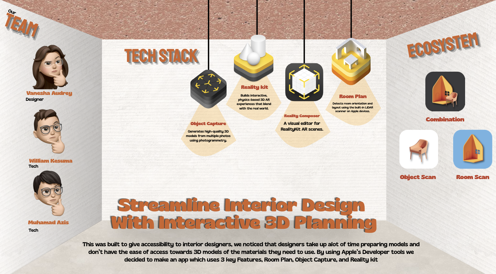

# Menata (SwiftUI, Room Plan, ARKit) - 2025

An AR-powered interior design assistant that accelerates 3D modeling by combining real-world spatial scanning and virtual editing. Menata helps designers visualize, edit, and reimagine spaces directly through Apple’s AR technologies.

## Overview
Menata is an AR-powered interior design assistant that helps users scan rooms, understand spatial layouts, and experiment with 3D furniture placement in real time. By leveraging Apple’s AR stack, it bridges physical spaces and virtual editing so designers can visualize changes quickly and make informed decisions.

## Preview
